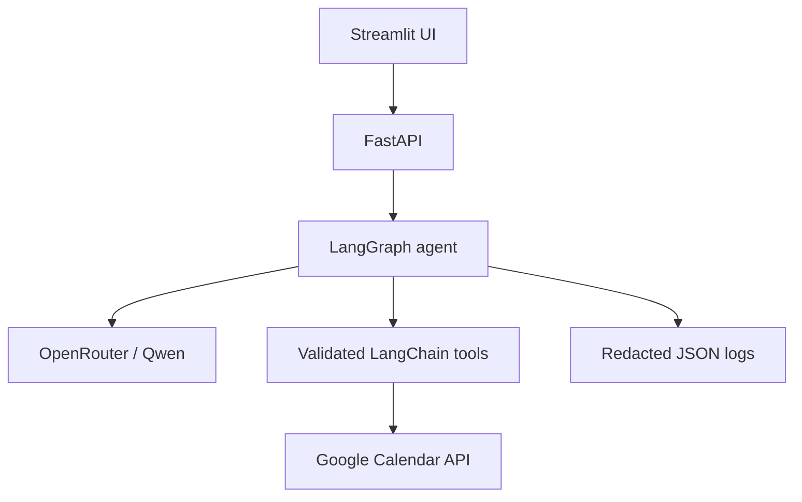

# Task Pilot

Task Pilot is a stateful AI calendar assistant that turns natural-language
requests into safe Google Calendar operations. It uses OpenRouter/Qwen for
structured intent extraction, LangGraph for multi-step routing and memory,
FastAPI for the backend, and Streamlit for the user interface.

**Project status:** Weeks 1–6 complete. Google OAuth, live Calendar CRUD,
OpenRouter, advanced scheduling, the backend, and the UI have been verified.

## Project overview

Task Pilot can understand requests such as “Move my DSA session tomorrow,”
search for the right event, ask a follow-up question when required, check for
conflicts, and execute the appropriate calendar operation. All application
times are normalized to `Asia/Kolkata` and displayed as readable IST values.

The application is designed around two safety rules:

- Ambiguous requests never guess which event to change.
- Deletes and bulk changes always show the affected events and require explicit
  confirmation before a mutation tool runs.

## Features

- Create, list, search, update, and delete Google Calendar events.
- Timezone-aware parsing for tomorrow, weekdays, next week, and relative hours.
- Stateful follow-up conversations using LangGraph checkpoints.
- Search-before-update and search-before-delete routing.
- Ambiguous-event resolution without unsafe calendar changes.
- Bulk rescheduling and deletion with confirmation.
- Conflict detection with alternative time suggestions.
- Free-slot discovery inside configurable working hours.
- Structured FastAPI responses and a conversational Streamlit UI.
- Rotating JSON workflow logs with secret redaction.
- A 45-query evaluation dataset and five-metric scoring utility.
- Offline unit tests, GitHub Actions CI, and Docker Compose deployment.

## Architecture



```text
START
  → Understand query
  → Determine intent
  → Search calendar when needed
  → Resolve zero, one, or multiple matches
  → Check conflicts / prepare bulk plan
  → Request confirmation for destructive actions
  → Execute validated tool
  → Verify structured result
  → Generate response
END
```

The Google client and LLM are initialized lazily. Test code injects scripted
planners and fake Calendar clients, so the complete graph can be exercised
without network calls or real calendar mutations.

## Tech stack

| Layer | Technology |
|---|---|
| Language | Python 3.12 |
| Calendar | Google Calendar API + OAuth 2.0 |
| LLM | Qwen3-30B-A3B through OpenRouter |
| Agent workflow | LangGraph |
| Tool layer | LangChain `StructuredTool` |
| Validation | Pydantic 2 |
| Backend | FastAPI + Uvicorn |
| Frontend | Streamlit |
| Testing | `unittest`, FastAPI TestClient, Streamlit AppTest |
| Deployment | Docker Compose + GitHub Actions |

## Target architecture

[**docs/ARCHITECTURE.md**](docs/ARCHITECTURE.md) is the same system drawn with
its seams made explicit — layer boundaries, the LangGraph state machine, the
safety model for calendar mutations, and a map (§19) from the shipped modules
above onto those layers.


The four decisions that shape everything else:

- **The calendar sits behind a port**, with an in-memory fake alongside the
  Google adapter, so everything above it runs offline against a seeded
  calendar. The shipped code reaches the same offline testing by faking the
  Google client itself; §19 covers what that trades away.
- **Nothing writes to a calendar directly.** Every change is first built as an
  inert `MutationPlan` that can be previewed, confirmed, logged, and asserted
  on. A single function executes one.
- **The model classifies and phrases; it never computes.** Dates, overlaps, and
  free-slot arithmetic are ordinary Python resolved against an injected clock.
- **Business logic lives in services, not in tools.** Every capability stays
  callable — and testable — with no LLM in the loop.

The six-week build shipped in the flat `app/` package below rather than this
layered tree. The document is a reference for where the seams go if the
codebase grows past it, not a description of the current directory layout.

## Project structure

```text
Task-Pilot/
├── app/
│   ├── api.py                 # FastAPI routes and lazy runtime
│   ├── calendar_service.py    # OAuth and Calendar CRUD
│   ├── calendar_tools.py      # Validated LangChain tools
│   ├── date_utils.py          # IST parsing and display
│   ├── evaluation.py          # Dataset validation and metric scoring
│   ├── graph_agent.py         # State, nodes, routing, and memory
│   ├── llm.py                 # OpenRouter model construction
│   ├── observability.py       # Structured redacted logging
│   ├── scheduling.py          # Conflicts, free slots, and bulk plans
│   └── schemas.py             # Pydantic tool inputs
├── docs/
│   ├── ARCHITECTURE.md        # layered target design for the calendar agent
│   └── architecture-diagram.png
├── evaluation/
│   ├── queries.json           # 45 realistic evaluation queries
│   └── predictions.example.json
├── tests/                     # Offline unit and regression tests
├── deployment/README.md       # Container deployment notes
├── streamlit_app.py
├── Dockerfile.api
├── Dockerfile.web
├── docker-compose.yml
└── requirements.txt
```

## Installation

PowerShell:

```powershell
git clone https://github.com/Srishanth0902/Task-Pilot.git
cd Task-Pilot
python -m venv .venv
.\.venv\Scripts\Activate.ps1
python -m pip install -r requirements.txt
Copy-Item .env.example .env
```

Set `OPENROUTER_API_KEY` in the local `.env` file. Never commit that file.

## Google OAuth setup

1. Create a Google Cloud project.
2. Enable the Google Calendar API.
3. Configure the OAuth consent screen and add your account as a test user when
   the application is in testing mode.
4. Create an OAuth client with application type **Desktop app**.
5. Download the client file as `credentials.json` into the project root.
6. Run `python -m app.main` once and complete the browser consent flow.

The app writes the resulting authorization to `token.json`. `.env`,
`credentials.json`, and `token.json` are Git-ignored and excluded from Docker
build contexts.

## Environment variables

| Variable | Default | Purpose |
|---|---|---|
| `GOOGLE_CREDENTIALS_FILE` | `credentials.json` | Desktop OAuth client path |
| `GOOGLE_TOKEN_FILE` | `token.json` | Refreshable user token path |
| `GOOGLE_CALENDAR_ID` | `primary` | Target calendar |
| `TIMEZONE` | `Asia/Kolkata` | Internal and displayed timezone |
| `WORKDAY_START_HOUR` | `8` | Free-slot search start |
| `WORKDAY_END_HOUR` | `21` | Free-slot search end |
| `OPENROUTER_API_KEY` | none | OpenRouter secret key |
| `OPENROUTER_MODEL` | `qwen/qwen3-30b-a3b` | Switchable model slug |
| `OPENROUTER_BASE_URL` | OpenRouter API | OpenAI-compatible endpoint |
| `API_HOST` | `127.0.0.1` | FastAPI bind address |
| `API_PORT` | `8000` | FastAPI port |
| `TASK_PILOT_API_URL` | `http://127.0.0.1:8000` | UI backend URL |
| `LOG_LEVEL` | `INFO` | Workflow log threshold |
| `LOG_FILE` | `logs/task_pilot.jsonl` | Rotating JSON log path |
| `LOG_MAX_BYTES` | `2000000` | Log rotation size |
| `LOG_BACKUP_COUNT` | `3` | Retained rotated files |

## Running the application

Terminal 1:

```powershell
python -m uvicorn app.api:app --host 127.0.0.1 --port 8000
```

Terminal 2:

```powershell
python -m streamlit run streamlit_app.py
```

Open `http://localhost:8501`. API documentation is available at
`http://127.0.0.1:8000/docs`, and configuration health is available at
`http://127.0.0.1:8000/health`.

## Example queries

```text
Add DSA tomorrow at 6 PM
What is on my calendar tomorrow?
Move my ML class to 8 PM
Delete my gym session on Friday
Move all study sessions tomorrow by 1 hour
Show me the available slots tomorrow after 6 PM
Find a 2-hour free slot tomorrow and schedule DSA practice
```

When several events match, Task Pilot asks which one. When a proposed create or
move overlaps another event, it blocks the operation and offers alternatives.
Availability-only questions return readable one-hour choices by default and do
not create anything. Phrases such as "tomorrow after 6 PM" are resolved
deterministically in IST even if the selected model omits structured range data.

## Agent workflow and logging

Each conversation uses a stable `thread_id`. The logs record:

```text
User query → intent → graph node → selected tool → tool input
           → tool output → verification → final response
```

Logs are newline-delimited JSON in `logs/task_pilot.jsonl`. They rotate
automatically, stay outside Git, and redact API keys, OAuth tokens,
authorization headers, passwords, and OpenRouter key patterns.

## Evaluation

`evaluation/queries.json` contains 45 realistic cases across CREATE, READ,
UPDATE, DELETE, BULK_UPDATE, FREE_SLOT_SEARCH, AMBIGUOUS_REQUEST, CONFLICT, and
FOLLOW_UP.

Validate the dataset:

```powershell
python -m app.evaluation
```

Score a prediction file:

```powershell
python -m app.evaluation `
  --predictions evaluation/predictions.example.json `
  --output evaluation/results/latest.json
```

The report measures intent accuracy, tool accuracy, execution success, safety,
and clarification quality. Missing predictions score as failures rather than
being silently excluded.

## Testing

The suite uses only fakes for mutations and can run without Google or OpenRouter
credentials:

```powershell
python -m unittest discover -s tests -t . -v
```

Coverage includes Calendar API payloads and failures, Pydantic inputs,
timezone parsing, agent routing, ambiguous queries, conflicts, bulk
confirmations, follow-up memory, FastAPI, Streamlit, evaluation scoring,
logging redaction, and destructive-action safety.

### Difficult prompt checks

`evaluation/difficult_prompts.json` defines 32 single-turn and follow-up cases.
Run the actual configured OpenRouter model and LangGraph against an in-memory
calendar containing synthetic meetings, Yoga and study sessions:

```powershell
python -m evaluation.run_difficult_prompts
```

This uses OpenRouter credits but never connects to Google or changes real events.
The runner checks intent, writes, exact times, matching-event counts, confirmation
state and affected events where specified. Its synthetic-only report is saved to
`evaluation/difficult_results.json`. Use `--ids rename free-evening` to rerun
selected failures; the report then combines the latest result for each case.

`tests/test_difficult_prompts.py` adds offline regression cases for imperfect
model plans, ordinal selections, qualified confirmations, all-day conflicts,
UTC/IST conversion, midnight and leap-year boundaries, multi-day availability,
and recovery after errors. These are finite coverage, not a guarantee for every
possible wording. Live model responses can vary between runs.

## Screenshots

The running interface is available at `http://localhost:8501`. It labels all
times as IST and renders event ranges in plain English instead of exposing
ISO-8601 timestamps. A calendar-populated screenshot is intentionally not
committed because it could publish private event names or schedules. Add only a
sanitized image under `docs/screenshots/` when preparing a public demo.

## Security

- Secrets and OAuth artifacts are excluded from Git and Docker images.
- Logs redact known credential fields and secret patterns.
- API messages and thread identifiers are length- and character-validated.
- Tool schemas reject invalid ranges and incomplete updates.
- All deletes and bulk mutations require an explicit confirmation turn.
- Calendar errors return structured failures instead of partial success.
- Containers run as an unprivileged user.

## Deployment

For the reference single-user deployment:

```powershell
docker compose up --build
```

The Compose stack runs FastAPI and Streamlit separately, waits for backend
health, mounts OAuth files at runtime, and keeps logs in a persistent volume.
See `deployment/README.md` for secret-storage and OAuth limitations.

Public multi-user hosting requires web OAuth redirects and encrypted per-user
token storage; the current Desktop OAuth flow is intentionally scoped to this
single-user project.

## Future improvements

- Replace in-memory LangGraph checkpoints with PostgreSQL or Redis.
- Add web OAuth and encrypted multi-user token storage.
- Run the evaluation dataset automatically against configured model versions.
- Add recurring-event editing and attendee management.
- Add rate limiting, authentication, and distributed tracing for public use.
- Migrate the frontend to React if richer calendar visualization is required.
