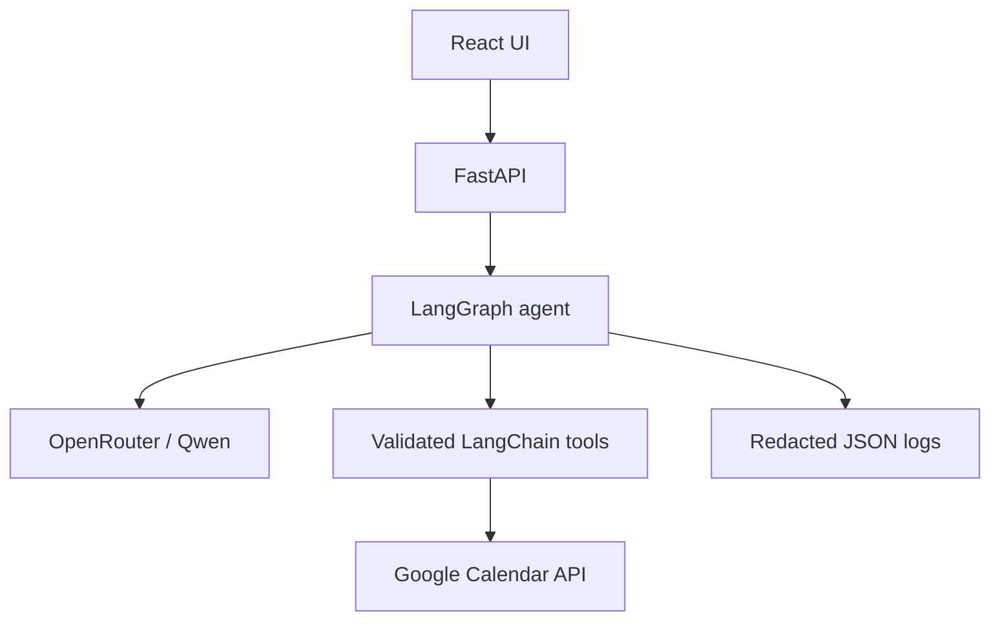

# Task Pilot

Task Pilot is a stateful AI calendar assistant that turns natural-language
requests into safe Google Calendar operations. It uses OpenRouter/Qwen for
structured intent extraction, LangGraph for multi-step routing and memory,
FastAPI for the backend, and React with TypeScript for the user interface.

**Web sign-in:** The API now requires a separate Google login for each user.
Tokens and conversations are encrypted and persisted locally; users can reopen
saved conversations after a restart. Follow [multi-user setup](docs/MULTIUSER.md)
to configure the new Web application OAuth client. Existing Desktop credentials
continue to work only with the CLI. Live multi-user OAuth requires that setup;
the account separation and persistence flows have automated test coverage.

## Project overview

Task Pilot can understand requests such as “Move my DSA session tomorrow,”
search for the right event, ask a follow-up question when required, check for
conflicts, and execute the appropriate calendar operation. All application
times are normalized to `Asia/Kolkata` and displayed as readable IST values.

The application is designed around two safety rules:

- Ambiguous requests never guess which event to change.
- Deletes and bulk changes always show the affected events and require explicit
  confirmation before a mutation tool runs.

## Features

- Works with Google Calendar **or** Task Pilot's own built-in calendar — no
  Google account required.
- Create, list, search, update, and delete calendar events.
- Assignment tracking with deadlines, subjects, priority levels and progress state.
- Smart Study Planner: generates study sessions from assignments, schedules them
  subject-wise around existing commitments, and tracks progress per subject.
- Email reminders ahead of events and assignment deadlines, with per-account
  lead times and an opt-out.
- Agenda, Week and Month views, plus iCalendar (.ics) and CSV export.
- Timezone-aware parsing for tomorrow, weekdays, next week, and relative hours.
- Stateful follow-up conversations using LangGraph checkpoints.
- Search-before-update and search-before-delete routing.
- Ambiguous-event resolution without unsafe calendar changes.
- Bulk rescheduling and deletion with confirmation.
- Conflict detection with alternative time suggestions.
- Free-slot discovery inside configurable working hours.
- Structured FastAPI responses and a responsive React agenda and assistant UI.
- Rotating JSON workflow logs with secret redaction.
- A 45-query evaluation dataset and five-metric scoring utility.
- Offline unit tests, GitHub Actions CI, and Docker Compose deployment.

## Conversation and scheduling preferences

The assistant retains the latest 12 messages plus compact facts about up to 20
previous event results. Pending tasks keep their title, time, duration, and
selected event separately. Read-only questions can interrupt a pending request;
the unfinished task remains available afterwards. When switching to another
task, one paused task can be retrieved with **Resume** or `resume previous task`.
This is bounded conversation memory, not unlimited recall of every past message.

Short duration replies, explicit time/date corrections, confirmations, and
common read requests use deterministic paths without another model request.
For example: `Schedule Yoga tomorrow at 6 PM` → `half an hour`.

In **Settings**, each account can save working hours, a preferred study starting
hour, breaks between suggested slots, and protected event titles. These values
are validated, encrypted, and kept separate for each Google account. Protected
titles block assistant moves/deletes until the setting is changed. Working hours
and breaks guide free-slot suggestions and automatic relocation; an explicit
user-specified time can still be outside those hours.

Enable **Review single event creations and time moves** to see a preview before
those changes. Bulk operations and deletes continue to require confirmation.
The composer displays the saved task and any missing duration.

**Undo last change** supports the most recent single event creation or time-only
move in a conversation. It asks for confirmation, rereads the event, checks its
Google version, and uses a conditional write. Undoing a move also checks that the
original slot remains free. Deletes, metadata edits, bulk changes, and coordinated
relocations do not have automatic undo. A later mutation replaces the undo record;
failed undo requests require inspecting the calendar before trying another action.
Event facts are context rather than a live calendar cache; normal conflict checks
still run before scheduling. Tests use simulated Google responses and do not
create or delete real calendar events.

## Architecture


```mermaid
flowchart TD
    UI[React UI] --> API[FastAPI]
    API --> GRAPH[LangGraph agent]
    GRAPH --> LLM[OpenRouter / Qwen]
    GRAPH --> TOOLS[Validated LangChain tools]
    TOOLS --> GCAL[Google Calendar API]
    GRAPH --> LOGS[Redacted JSON logs]
```

```text
START
  → Understand query
  → Determine intent
  → Search calendar when needed
  → Resolve zero, one, or multiple matches
  → Check conflicts / prepare bulk plan
  → Request confirmation for destructive actions
  → Execute validated tool
  → Verify structured result
  → Generate response
END
```

The Google client and LLM are initialized lazily. Test code injects scripted
planners and fake Calendar clients, so the complete graph can be exercised
without network calls or real calendar mutations.

## Tech stack

| Layer | Technology |
|---|---|
| Language | Python 3.12 |
| Calendar | Google Calendar API + OAuth 2.0 |
| LLM | Qwen3-30B-A3B through OpenRouter |
| Agent workflow | LangGraph |
| Tool layer | LangChain `StructuredTool` |
| Validation | Pydantic 2 |
| Backend | FastAPI + Uvicorn |
| Frontend | React, TypeScript, Vite, TanStack Query, custom CSS |
| Testing | `unittest`, FastAPI TestClient, Vitest, Playwright |
| Deployment | Docker Compose + GitHub Actions |

## Project structure

```text
Task-Pilot/
├── app/
│   ├── api.py                 # FastAPI routes and lazy runtime
│   ├── calendar_service.py    # OAuth and Calendar CRUD
│   ├── calendar_tools.py      # Validated LangChain tools
│   ├── date_utils.py          # IST parsing and display
│   ├── evaluation.py          # Dataset validation and metric scoring
│   ├── graph_agent.py         # State, nodes, routing, and memory
│   ├── llm.py                 # OpenRouter model construction
│   ├── observability.py       # Structured redacted logging
│   ├── scheduling.py          # Conflicts, free slots, and bulk plans
│   └── schemas.py             # Pydantic tool inputs
├── evaluation/
│   ├── queries.json           # 45 realistic evaluation queries
│   └── predictions.example.json
├── tests/                     # Offline unit and regression tests
├── deployment/README.md       # Container deployment notes
├── streamlit_app.py
├── Dockerfile.api
├── Dockerfile.web
├── docker-compose.yml
└── requirements.txt
```

## Installation

PowerShell:

```powershell
git clone https://github.com/Srishanth0902/Task-Pilot.git
cd Task-Pilot
python -m venv .venv
.\.venv\Scripts\Activate.ps1
python -m pip install -r requirements.txt
Copy-Item .env.example .env
```

Set `OPENROUTER_API_KEY` in the local `.env` file. Never commit that file.

## Google OAuth setup

1. Create a Google Cloud project.
2. Enable the Google Calendar API.
3. Configure the OAuth consent screen and add your account as a test user when
   the application is in testing mode.
4. Create an OAuth client with application type **Desktop app**.
5. Download the client file as `credentials.json` into the project root.
6. Run `python -m app.main` once and complete the browser consent flow.

The app writes the resulting authorization to `token.json`. `.env`,
`credentials.json`, and `token.json` are Git-ignored and excluded from Docker
build contexts.

## Email reminders

Reminders are sent by a worker process, separate from the API. Configure SMTP in
`.env` (use an app password, never your main account password):

```
SMTP_HOST=smtp.gmail.com
SMTP_PORT=587
SMTP_USERNAME=you@example.com
SMTP_PASSWORD=your-app-password
SMTP_SENDER=you@example.com
```

Run a single sweep from cron, or leave it looping beside the API:

```
python -m app.reminder_worker --once
python -m app.reminder_worker --interval 900
```

By default a reminder goes out 24 hours and 1 hour before an event, and 48 and
24 hours before an assignment deadline. Accounts can change those lead times or
turn reminders off entirely in their preferences. Each reminder is claimed in
the database before it is sent, so running the sweep from several places at
once cannot double-send. Pass `--no-calendar` to send deadline reminders only,
without reading Google Calendar.

## Assignments and the Smart Study Planner

Assignments carry a title, subject, deadline, priority, status and an effort
estimate. The planner turns unfinished assignments into study sessions, placing
them in free time before each deadline, most urgent first.

| Route | Purpose |
|---|---|
| `GET/POST /assignments` | List and create assignments |
| `PUT/DELETE /assignments/{id}` | Update or remove one |
| `POST /study/plan` | Generate and save a plan |
| `GET /study/plan` | The current plan |
| `PUT /study/sessions/{id}?status=done` | Tick a session off |
| `GET /study/progress` | Per-subject and overall progress |
| `GET /export/calendar.ics` | Download the schedule as iCalendar |
| `GET /export/schedule.csv` | Download the schedule as CSV |

Work that cannot fit before its deadline is reported in the `unscheduled` field
rather than dropped. Re-planning keeps sessions already marked done and
schedules only the effort that remains.

## Calendars: Google or built-in

Task Pilot can keep your schedule in one of two places, and the choice is
yours at the door:

| | Google Calendar | Task Pilot calendar |
|---|---|---|
| Needs a Google account | Yes | No |
| Where events live | Your Google account | This app's database |
| Reachable from another device | Yes | Only by signing in with Google |
| Agent, reminders, study planner, export | Yes | Yes |

**Connect Google Calendar** signs you in and works against your real calendar.
**Use app's native calendar** opens a workspace straight away, with no Google
account and nothing sent to Google.

### How the active calendar is decided

The server decides, never the browser. An explicit choice wins; otherwise
Google is used when it is connected and the built-in calendar when it is not.
The current calendar is named in the sidebar, and where both are available a
switch sits beside it.

Two rules are deliberate and worth knowing:

- **Expired or failing Google access never falls back to the built-in
  calendar.** You are told what failed and offered the switch. A silent
  downgrade would write your events somewhere you did not choose and would not
  think to look.
- **A pending confirmation belongs to the calendar it was planned on.** Switch
  calendars while an action is waiting for yes or no and the plan is dropped
  with an explanation, rather than executed against the wrong calendar.

The two calendars stay separate. Nothing is copied or synchronised between
them.

### Guest workspaces

Choosing the built-in calendar creates a guest workspace held by a secure,
server-issued session cookie. Each guest is a distinct workspace, not a shared
anonymous account, and one guest cannot see another's events.

Guest access is tied to that browser. Clearing cookies loses access to the
workspace, and there is no way to recover it — connect Google if you need the
same schedule on another device.

### For developers

`app/calendar_provider.py` defines one interface with two implementations.
The LangChain tools, the LangGraph workflow, undo and the HTTP routes all call
that interface, so neither the agent nor the tools contain per-provider
branching. Adding a third calendar means writing one class.

Native events carry a version token that does the job Google's etag does, so
conditional writes behave the same on both calendars. Native events report no
`html_link`: inventing a Google URL for an event Google has never seen would
send you to a 404.

| Route | Purpose |
|---|---|
| `POST /auth/guest` | Open a guest workspace on the built-in calendar |
| `GET /calendar/status` | Active calendar, what else is available, guest flag |
| `PUT /calendar/provider?provider=…` | Switch calendars |

## Environment variables

| Variable | Default | Purpose |
|---|---|---|
| `GOOGLE_CREDENTIALS_FILE` | `credentials.json` | Desktop OAuth client path |
| `GOOGLE_TOKEN_FILE` | `token.json` | Refreshable user token path |
| `GOOGLE_CALENDAR_ID` | `primary` | Target calendar |
| `TIMEZONE` | `Asia/Kolkata` | Internal and displayed timezone |
| `WORKDAY_START_HOUR` | `8` | Free-slot search start |
| `WORKDAY_END_HOUR` | `21` | Free-slot search end |
| `OPENROUTER_API_KEY` | none | OpenRouter secret key |
| `OPENROUTER_MODEL` | `qwen/qwen3.8-27b:free` | Switchable free-model slug |
| `OPENROUTER_FREE_ONLY` | `true` | Reject paid model IDs and require zero-price providers |
| `DATABASE_URL` | empty (local SQLite) | Cloud PostgreSQL URL; required in free deployment mode |
| `OPENROUTER_BASE_URL` | OpenRouter API | OpenAI-compatible endpoint |
| `API_HOST` | `127.0.0.1` | FastAPI bind address |
| `API_PORT` | `8000` | FastAPI port |
| `TASK_PILOT_API_URL` | `http://127.0.0.1:8000` | UI backend URL |
| `PUBLIC_APP_URL` | `http://127.0.0.1:5173` | Browser-facing origin and OAuth callback base |
| `GOOGLE_WEB_CREDENTIALS_FILE` | `credentials.web.json` | Multi-user Web OAuth client path |
| `DATA_DIRECTORY` | `data` | Encrypted users, sessions, and conversations |
| `TOKEN_ENCRYPTION_KEY` | local generated key | Required external Fernet key for HTTPS deployment |
| `SESSION_MAX_AGE_DAYS` | `30` | Renewable browser-login lifetime (1–365 days) |
| `LOG_LEVEL` | `INFO` | Workflow log threshold |
| `LOG_FILE` | `logs/task_pilot.jsonl` | Rotating JSON log path |
| `LOG_MAX_BYTES` | `2000000` | Log rotation size |
| `LOG_BACKUP_COUNT` | `3` | Retained rotated files |
| `SMTP_HOST` | none | Reminder mail server; required by the reminder worker |
| `SMTP_PORT` | `587` | Reminder mail server port |
| `SMTP_USERNAME` | none | Reminder mail login |
| `SMTP_PASSWORD` | none | Reminder mail app password |
| `SMTP_SENDER` | `SMTP_USERNAME` | From address on reminder emails |
| `SMTP_USE_TLS` | `true` | STARTTLS for reminder mail |

## Running the application

Terminal 1:

```powershell
python -m uvicorn app.api:app --host 127.0.0.1 --port 8000
```

Terminal 2:

```powershell
cd frontend
npm ci
npm run dev
```

Open `http://localhost:5173`. API documentation is available at
`http://127.0.0.1:8000/docs`, and configuration health is available at
`http://127.0.0.1:8000/health`.

The React workspace follows the supplied Stitch reference: a cream and forest
agenda, persistent assistant panel, mobile navigation, event details, slot review,
and confirmation controls. The Week view lists the next seven days. Browser API
requests go through Vite's `/api` proxy in development and Nginx in Docker, so no
Google or OpenRouter credentials enter the browser bundle. Node.js 24 is used by
the build. Streamlit remains available as a legacy interface via
`python -m streamlit run streamlit_app.py`.

Frontend checks (from `frontend/`):

```powershell
npm run build
npm test
npx playwright install chromium
npx playwright test
```

The browser tests use synthetic API responses and do not change Google Calendar.

## Example queries

```text
Add DSA tomorrow at 6 PM for one hour
Schedule an urgent meeting tomorrow at 6 PM for one hour and move Yoga to the next available slot
What is on my calendar tomorrow?
Move my ML class to 8 PM
Delete my gym session on Friday
Move all study sessions tomorrow by 1 hour
Show me the available slots tomorrow after 6 PM
Find a 2-hour free slot tomorrow and schedule DSA practice
```

When several events match, Task Pilot asks which one. When a proposed create or
move overlaps another event, it blocks the operation and offers alternatives.
Create requests without an explicit duration or end time pause and ask how long
the event should last before making any Google Calendar change.
Availability-only questions return readable one-hour choices by default and do
not create anything. Phrases such as "tomorrow after 6 PM" are resolved
deterministically in IST even if the selected model omits structured range data.

### Making room for urgent events

An urgent create request can propose moving the occupying events into free slots
later that day. The proposal preserves their durations and requires confirmation.
Explicit instructions to move a named conflicting event to the next available slot
authorize that move without a second confirmation; extra affected events still
require review. Specify a replacement day to search that day instead (up to 31
days ahead). No event is deleted to make room, and no changes are made if a full
replacement plan cannot be found.

The agent rechecks the reviewed schedule, moves the occupying events, then creates
the new event. Google Calendar does not provide an atomic transaction across these
operations: on failure the agent stops and reports completed moves, without
automatically retrying or claiming to have undone them. External edits can still
race with execution. This workflow currently handles a new event plus relocation
of its conflicts, not arbitrary chains of moves across an entire calendar.

## Agent workflow and logging

Each conversation uses a stable `thread_id`. The logs record:

```text
User query → intent → graph node → selected tool → tool input
           → tool output → verification → final response
```

Logs are newline-delimited JSON in `logs/task_pilot.jsonl`. They rotate
automatically, stay outside Git, and redact API keys, OAuth tokens,
authorization headers, passwords, and OpenRouter key patterns.

## Evaluation

`evaluation/queries.json` contains 45 realistic cases across CREATE, READ,
UPDATE, DELETE, BULK_UPDATE, FREE_SLOT_SEARCH, AMBIGUOUS_REQUEST, CONFLICT, and
FOLLOW_UP.

Validate the dataset:

```powershell
python -m app.evaluation
```

Score a prediction file:

```powershell
python -m app.evaluation `
  --predictions evaluation/predictions.example.json `
  --output evaluation/results/latest.json
```

The report measures intent accuracy, tool accuracy, execution success, safety,
and clarification quality. Missing predictions score as failures rather than
being silently excluded.

## Testing

The suite uses only fakes for mutations and can run without Google or OpenRouter
credentials:

```powershell
python -m unittest discover -s tests -t . -v
```

Coverage includes Calendar API payloads and failures, Pydantic inputs,
timezone parsing, agent routing, ambiguous queries, conflicts, bulk
confirmations, follow-up memory, FastAPI, Streamlit, evaluation scoring,
logging redaction, and destructive-action safety.

For the complete deployment test matrix in an isolated worktree, run
`python scripts/verify_worker.py`. It creates a local Python environment,
installs the locked project dependencies, runs backend and frontend checks,
and checks Docker before attempting image builds. The per-check report and logs
are written to `.worker-results/` (ignored by Git). Run
`python scripts/verify_worker.py --preflight` to check tool availability only.
Use `--python-only` to validate Python bootstrap and backend checks separately.
Exit codes are 0 for all checks passed, 1 for a failed check, and 2 when a
required check could not be verified. CI should verify Docker builds when the
local Docker engine is unavailable.

### Difficult prompt checks

`evaluation/difficult_prompts.json` defines 32 single-turn and follow-up cases.
Run the actual configured OpenRouter model and LangGraph against an in-memory
calendar containing synthetic meetings, Yoga and study sessions:

```powershell
python -m evaluation.run_difficult_prompts
```

This uses OpenRouter credits but never connects to Google or changes real events.
The runner checks intent, writes, exact times, matching-event counts, confirmation
state and affected events where specified. Its synthetic-only report is saved to
`evaluation/difficult_results.json`. Use `--ids rename free-evening` to rerun
selected failures; the report then combines the latest result for each case.

`tests/test_difficult_prompts.py` adds offline regression cases for imperfect
model plans, ordinal selections, qualified confirmations, all-day conflicts,
UTC/IST conversion, midnight and leap-year boundaries, multi-day availability,
and recovery after errors. These are finite coverage, not a guarantee for every
possible wording. Live model responses can vary between runs.

## Screenshots

The development interface is available at `http://localhost:5173` (Docker uses
port `8501`). It labels all
times as IST and renders event ranges in plain English instead of exposing
ISO-8601 timestamps. A calendar-populated screenshot is intentionally not
committed because it could publish private event names or schedules. Add only a
sanitized image under `docs/screenshots/` when preparing a public demo.

## Security

- Secrets and OAuth artifacts are excluded from Git and Docker images.
- Logs redact known credential fields and secret patterns.
- API messages and thread identifiers are length- and character-validated.
- Tool schemas reject invalid ranges and incomplete updates.
- All deletes and bulk mutations require an explicit confirmation turn.
- Calendar errors return structured failures instead of partial success.
- Containers run as an unprivileged user.

## Deployment

For the **zero-subscription pilot**, use [Free hosting preparation](deployment/FREE_HOSTING.md).
The prepared Render Free Blueprint serves the frontend and API from one origin,
uses Neon PostgreSQL for durable encrypted records, Brevo HTTPS for email, and a
disabled-until-enabled GitHub reminder schedule. It includes persistent usage
limits and an OpenRouter free-only price guard. It does not create provider
accounts, deploy the app, or configure Google's public callback automatically.
The combined production package is tested with `python scripts/verify_deployment.py --build`
(Docker required). It exercises the real entrypoint, TLS PostgreSQL, compiled
frontend assets, protected API routes, callback URL, restart persistence, and
storage-failure readiness; CI runs the same check before auto-deployment.

For deployment preparation without publishing, see [When ready](deployment/WHEN_READY.md).
The production Compose file is separate from local development and leaves your
domain and secrets unset until you choose a host.

After configuring web OAuth and encryption as described in `docs/MULTIUSER.md`:

```powershell
docker compose up --build
```

The Compose stack runs FastAPI and the React/Nginx frontend separately, waits for backend
health, mounts OAuth files at runtime, and keeps logs in a persistent volume.
See `deployment/README.md` for secret-storage and OAuth limitations.

The web API supports separate Google accounts, explicit account switching,
30-day renewable logins, and encrypted persistent storage on one host. Use HTTPS
and an externally managed encryption key when deploying.
Setting `DATABASE_URL` selects PostgreSQL persistence and transaction advisory
locks; local development retains SQLite and file locks. The free deployment
configuration runs one web service, not a multi-instance high-availability cluster.

## Conversation regression coverage

### Reply latency

Exact standalone reads such as `Show my tasks tomorrow` and `List events today`
skip model interpretation, but still fetch fresh Calendar data. Qualified queries,
follow-ups, and writes use the normal planner and all existing safety checks.
Planner context uses compact JSON without dropping fields or conversation history.
Workflow `graph_node_finished` logs include `duration_ms` for latency diagnosis.

`python -m evaluation.benchmark_reads` compares the shortcut with a model-driven
equivalent using a synthetic calendar (three samples each). One local run measured
median 0.015 seconds versus 1.799 seconds; these are not production latency promises
and exclude Google network time. No model was downgraded and calendar checks were
not cached or removed.

The planner receives the last 12 conversation messages, including completed actions.
Bare clock times retain an established PM interpretation; an ambiguous time that
would otherwise create an event earlier today asks for AM/PM clarification.
Questions such as “What are my next tasks right now?” list remaining events.

Explicit requests such as “Move Yoga to 11 PM and keep Homework at 9:50 PM”
produce a reviewed plan containing both changes. Existing event durations are
preserved, including moves across midnight. Plans require confirmation and are
rechecked before execution. Duplicate matches, overlapping destinations, and
swaps requiring a temporary slot are rejected without writes. Up to five actions
are supported in a coordinated plan; this is not a general-purpose arbitrary
calendar optimizer. Calendar writes are not transactional; partial failures are
reported rather than retried automatically.

Run deterministic regressions with `python -m unittest tests.test_conversation_repairs`.
Run `python -m evaluation.run_conversation_repairs` to replay the conversation
against the configured OpenRouter model using an in-memory calendar. The latter
uses model credits but never contacts Google Calendar.

## Future improvements

- Add high-availability deployment and automated encrypted backup/restore checks.
- Run the evaluation dataset automatically against configured model versions.
- Add recurring-event editing and attendee management.
- Extend abuse controls and add distributed tracing for broader public use.
- Expand the React frontend's calendar visualization.
