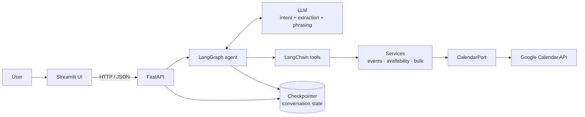
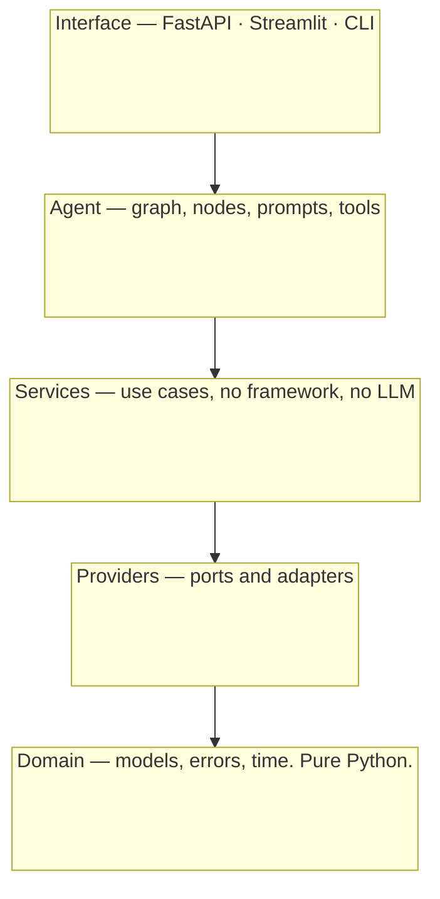
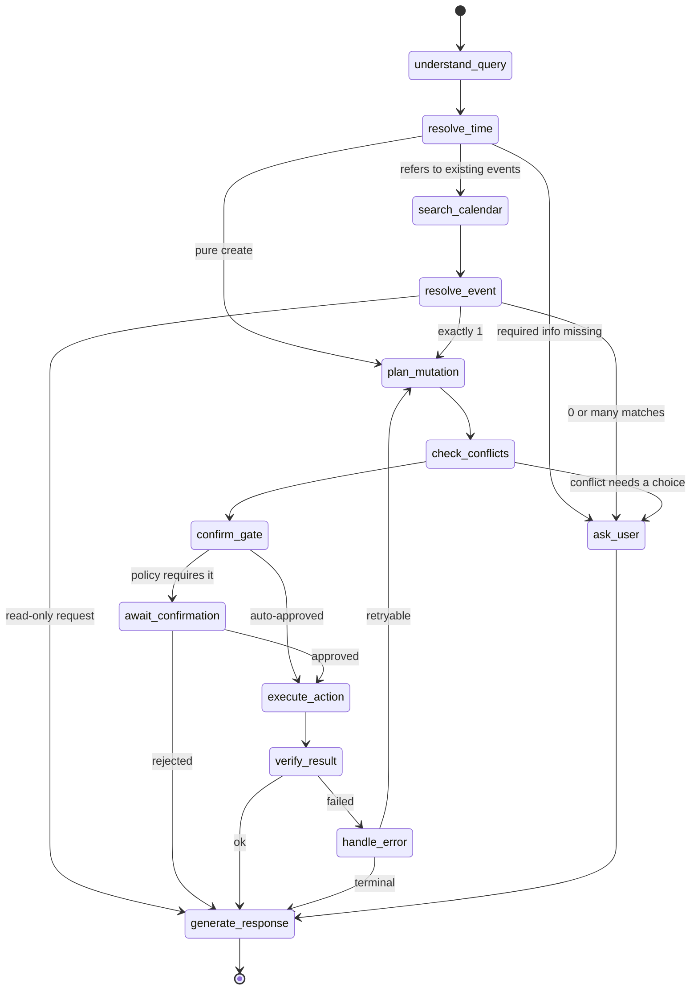
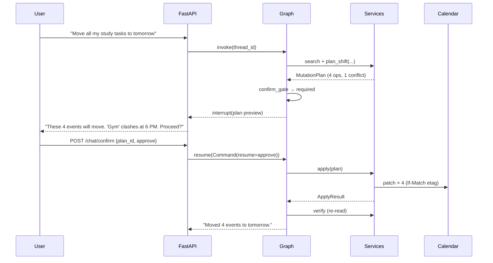
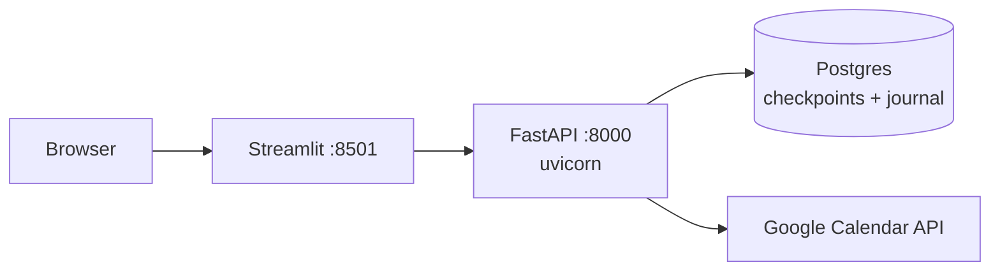

# Task-Pilot — Architecture

Target architecture for the 6-week agentic calendar assistant. It describes the
end state, the layer boundaries that get us there, and the week-by-week path
from the Week 1 code that exists today.


The clay path is the write path. Everything else is a read or a proposal.
Regenerate the figure with `python docs/diagram/generate.py` and
`node docs/diagram/render.js`.

Read this before adding a module. The value of the design is almost entirely in
the boundaries — where each kind of logic is allowed to live, and what is
forbidden to import what.

- [1. Design goals](#1-design-goals)
- [2. System overview](#2-system-overview)
- [3. Layers and the dependency rule](#3-layers-and-the-dependency-rule)
- [4. Directory structure](#4-directory-structure)
- [5. Domain layer](#5-domain-layer)
- [6. Provider layer: ports and adapters](#6-provider-layer-ports-and-adapters)
- [7. Service layer](#7-service-layer)
- [8. Tool layer](#8-tool-layer)
- [9. Agent layer: the LangGraph machine](#9-agent-layer-the-langgraph-machine)
- [10. Safety: plan, preview, confirm, apply](#10-safety-plan-preview-confirm-apply)
- [11. Time: the highest-risk subsystem](#11-time-the-highest-risk-subsystem)
- [12. API layer](#12-api-layer)
- [13. UI layer](#13-ui-layer)
- [14. Cross-cutting concerns](#14-cross-cutting-concerns)
- [15. Testing architecture](#15-testing-architecture)
- [16. Evaluation harness](#16-evaluation-harness)
- [17. Security](#17-security)
- [18. Deployment](#18-deployment)
- [19. Migration path from today's code](#19-migration-path-from-todays-code)
- [20. Decision record](#20-decision-record)

---

## 1. Design goals

Ranked. When two goals conflict, the higher one wins.

| # | Goal | What it forces |
|---|------|----------------|
| 1 | **Never damage a real calendar** | Every mutation is planned, previewed, and confirmed before it executes. Exactly one function writes. |
| 2 | **Testable without Google and without an LLM** | The calendar provider is a port with a fake implementation; time comes from an injected clock. |
| 3 | **Deterministic where determinism is possible** | The LLM classifies intent and extracts phrases. It does not compute dates, detect conflicts, or do arithmetic. |
| 4 | **Debuggable end to end** | One trace ID per turn, one structured log line per graph node, showing input and output. |
| 5 | **Extensible by addition** | A new capability is a new service function plus a new tool plus (rarely) a new node — not an edit to five existing files. |

The second goal is the load-bearing one. It is what makes the Week 6 evaluation
harness possible at all: 50 queries can be replayed against a seeded in-memory
calendar with a frozen clock, in seconds, with no network and no risk. An
architecture that only talks to the real Google API cannot be evaluated, only
demoed.

---

## 2. System overview



A turn in one paragraph: the UI posts a message and a session ID to
`POST /chat`. FastAPI loads that session's checkpoint and invokes the graph. The
graph classifies intent, resolves any time expression deterministically,
searches the calendar if the request refers to existing events, builds a
**mutation plan**, and either executes it or pauses to ask the user a question.
If it pauses, the checkpoint holds everything; the next message resumes the same
graph run rather than starting a new one.

---

## 3. Layers and the dependency rule

Five layers. **Imports point in one direction only: outer may import inner,
never the reverse.**



| Layer | May import | Must never contain |
|-------|-----------|--------------------|
| **Domain** | stdlib, Pydantic | I/O, network, LLM, framework types |
| **Providers** | domain | business rules, prompt text |
| **Services** | domain, provider *ports* | LangChain/LangGraph types, `googleapiclient` |
| **Agent** | domain, services, tool schemas | direct `googleapiclient` calls, raw HTTP |
| **Interface** | everything below | business rules |

Two rules that carry most of the weight:

1. **Services never import LangChain.** Every capability is callable from a
   plain Python script, a test, or a REST endpoint with no LLM in the loop. The
   tool layer is a thin adapter over services, not the home of the logic.
2. **Only the provider layer imports `googleapiclient`.** Google's event dicts
   never escape `providers/`; they are mapped to domain models at the boundary.
   This is already true of today's `calendar_service.py` and is worth keeping.

Enforce it mechanically rather than by discipline — add
[`import-linter`](https://import-linter.readthedocs.io/) to CI with the layer
contract declared in `pyproject.toml`. A one-time 20-line config prevents the
slow collapse into a ball of mud that this kind of project usually suffers
around Week 4.

---

## 4. Directory structure

```
Task-Pilot/
├── app/
│   ├── __init__.py
│   ├── config.py                   # Settings object (pydantic-settings)
│   │
│   ├── domain/                     # LAYER 1 — pure. No I/O.
│   │   ├── models.py               # CalendarEvent, TimeSlot, EventPatch,
│   │   │                           #   MutationPlan, Operation, Conflict
│   │   ├── errors.py               # error taxonomy (§14.3)
│   │   └── timex.py                # Clock, TimeWindow, TimeResolver (§11)
│   │
│   ├── providers/                  # LAYER 2 — ports & adapters
│   │   ├── port.py                 # CalendarPort protocol
│   │   ├── google_client.py        # GoogleCalendarAdapter
│   │   ├── google_auth.py          # OAuth strategies + TokenStore
│   │   ├── mapper.py               # Google resource <-> CalendarEvent
│   │   └── fake.py                 # FakeCalendarAdapter (tests, evals, demo)
│   │
│   ├── services/                   # LAYER 3 — use cases
│   │   ├── event_service.py        # create / get / search / update / delete
│   │   ├── availability.py         # conflicts, gaps, free-slot search
│   │   ├── bulk.py                 # plan + apply for multi-event changes
│   │   └── journal.py              # mutation journal, undo support
│   │
│   ├── agent/                      # LAYER 4
│   │   ├── graph.py                # build_graph(deps) -> CompiledGraph
│   │   ├── state.py                # AgentState
│   │   ├── routing.py              # conditional-edge predicates
│   │   ├── llm.py                  # model factory, structured-output helpers
│   │   ├── nodes/
│   │   │   ├── understand_query.py
│   │   │   ├── resolve_time.py
│   │   │   ├── search_calendar.py
│   │   │   ├── resolve_event.py
│   │   │   ├── plan_mutation.py
│   │   │   ├── check_conflicts.py
│   │   │   ├── await_confirmation.py
│   │   │   ├── execute_action.py
│   │   │   ├── verify_result.py
│   │   │   ├── ask_user.py
│   │   │   ├── generate_response.py
│   │   │   └── handle_error.py
│   │   ├── prompts/                # .md templates, one per node that needs one
│   │   └── tools/
│   │       ├── schemas.py          # Pydantic tool inputs
│   │       ├── read_tools.py
│   │       ├── write_tools.py
│   │       └── registry.py         # build_tools(deps) -> list[BaseTool]
│   │
│   ├── api/                        # LAYER 5
│   │   ├── main.py                 # create_app() factory
│   │   ├── deps.py                 # dependency container / wiring
│   │   ├── schemas.py              # request & response DTOs
│   │   └── routes/
│   │       ├── chat.py             # POST /chat, POST /chat/confirm
│   │       ├── events.py           # GET /events
│   │       └── health.py           # GET /health, GET /health/ready
│   │
│   ├── observability/
│   │   ├── logging.py              # structured JSON logging
│   │   └── trace.py                # trace_id context var, node span helper
│   │
│   └── cli.py                      # replaces today's app/main.py
│
├── ui/
│   └── streamlit_app.py            # thin HTTP client — no business logic
│
├── evals/
│   ├── dataset.yaml                # 30–50 cases (§16)
│   ├── runner.py
│   ├── metrics.py
│   └── reports/                    # gitignored output
│
├── tests/
│   ├── conftest.py                 # fixtures: frozen clock, fake calendar, stub LLM
│   ├── unit/                       # domain, mapper, availability math
│   ├── contract/                   # same suite vs fake AND real adapter
│   ├── graph/                      # routing with a stubbed LLM
│   └── e2e/                        # FastAPI TestClient + fake provider
│
├── docs/
│   ├── ARCHITECTURE.md             # this file
│   └── adr/                        # one file per significant decision
│
├── pyproject.toml                  # deps, tool config, import-linter contract
├── .env.example
├── .gitignore
└── README.md
```

Two naming notes. The provider package is `app/providers/`, not `app/calendar/`,
because a top-level-looking `calendar` package invites confusion with the
standard library module of that name. And nodes get one file each rather than
one big `nodes.py` — by Week 4 there are a dozen of them, and per-file nodes keep
diffs and merge conflicts small.

---

## 5. Domain layer

Pure data and pure functions. No network, no LLM, no framework. Everything else
is built on these types, which is why they are worth getting right first.

```python
# app/domain/models.py

class CalendarEvent(BaseModel):
    """Provider-neutral event. Google's wire format never leaves providers/."""
    id: str
    title: str
    start: datetime                  # always timezone-aware
    end: datetime                    # always timezone-aware
    all_day: bool = False
    description: str | None = None
    location: str | None = None
    etag: str | None = None          # optimistic concurrency (§10.3)
    created_by_agent: bool = False   # set from extendedProperties
    calendar_id: str = "primary"

class TimeWindow(BaseModel):
    """An absolute span. Both ends timezone-aware, always."""
    start: datetime
    end: datetime
    def overlaps(self, other: "TimeWindow") -> bool: ...
    def duration(self) -> timedelta: ...

TimeSlot = TimeWindow                # alias, read as "a window that is free"

class TimeRange(BaseModel):
    """A recurring wall-clock range, e.g. working hours 09:00-18:00."""
    start: time
    end: time

class Intent(StrEnum):
    CREATE = "CREATE"; READ = "READ"; UPDATE = "UPDATE"; DELETE = "DELETE"
    BULK_UPDATE = "BULK_UPDATE"; FREE_SLOT_SEARCH = "FREE_SLOT_SEARCH"
    AMBIGUOUS = "AMBIGUOUS"; UNSUPPORTED = "UNSUPPORTED"

class EventPatch(BaseModel):
    """A partial change. None means 'leave unchanged'."""
    title: str | None = None
    start: datetime | None = None
    end: datetime | None = None
    description: str | None = None
    location: str | None = None

class Operation(BaseModel):
    kind: Literal["create", "update", "delete"]
    target: CalendarEvent | None      # None for create
    patch: EventPatch | None          # None for delete
    draft: CalendarEvent | None       # None for update/delete
    reason: str                       # human-readable, shown in the preview

class Conflict(BaseModel):
    operation_index: int
    with_event: CalendarEvent
    overlap: TimeWindow

class MutationPlan(BaseModel):
    """The only thing that is ever executed against a calendar."""
    plan_id: str                      # deterministic hash of the operations
    operations: list[Operation]
    conflicts: list[Conflict] = []
    alternatives: list[TimeSlot] = [] # offered when conflicts exist
    low_confidence: bool = False      # fuzzy event match
    created_at: datetime

    @property
    def is_destructive(self) -> bool:
        return any(op.kind == "delete" for op in self.operations) or any(
            op.kind == "update" and op.patch and op.patch.start for op in self.operations
        )

class ApplyResult(BaseModel):
    """The outcome of executing a plan. Partial success is reported honestly."""
    plan_id: str
    succeeded: list[Operation] = []
    failed: list[tuple[Operation, AgentError]] = []

    @property
    def ok(self) -> bool:
        return not self.failed
```

`Intent` deliberately uses the same names as the Week 6 evaluation categories, so
a case's `category` is directly comparable to the intent the agent produced — no
mapping table to drift out of sync.

`MutationPlan` is the centrepiece of the design. It is a *value*: constructing
one is free of side effects, so it can be shown to the user, logged, diffed,
serialized into an API response, asserted on in a test, and scored by the eval
harness — all before anything touches a calendar. Every safety feature in
Section 10 is a property of this object rather than a check scattered across
call sites.

---

## 6. Provider layer: ports and adapters

### 6.1 The port

```python
# app/providers/port.py

class CalendarPort(Protocol):
    def list_events(self, window: TimeWindow, *, query: str | None = None,
                    max_results: int = 50) -> list[CalendarEvent]: ...
    def get_event(self, event_id: str) -> CalendarEvent: ...
    def insert_event(self, event: CalendarEvent) -> CalendarEvent: ...
    def patch_event(self, event_id: str, patch: EventPatch, *,
                    etag: str | None = None) -> CalendarEvent: ...
    def delete_event(self, event_id: str, *, etag: str | None = None) -> None: ...
    def calendar_name(self) -> str: ...
```

Six methods. Everything above this line — conflict detection, free-slot search,
bulk shifting, disambiguation — is composed from them in the service layer, so
none of it needs a network connection to test.

### 6.2 Adapters

| Adapter | Used by | Notes |
|---------|---------|-------|
| `GoogleCalendarAdapter` | production, `cli.py` | wraps today's `calendar_service.py` calls; translates `HttpError` into the domain error taxonomy; sends `If-Match` when an etag is supplied |
| `FakeCalendarAdapter` | unit tests, graph tests, evals, offline demo | in-memory dict; same semantics including etag conflicts; seedable from a fixture list |

Both must pass one shared contract test suite (`tests/contract/`). The fake is
only trustworthy as a test double if it is held to the same contract as the real
adapter — otherwise green tests mean nothing. Run the suite against the fake on
every commit and against a dedicated throwaway Google test calendar on demand.

### 6.3 Auth

`google_auth.py` keeps two flows behind one interface, because local development
and deployment need genuinely different ones:

| Strategy | When | Mechanism |
|----------|------|-----------|
| `InstalledAppFlow` | local dev (today) | `run_local_server(port=0)`, token cached to `token.json` |
| `WebFlow` | deployed (Week 6) | Web-application OAuth client, `/auth/callback` route, token in a `TokenStore` |

This matters more than it looks. The current README's troubleshooting section
already notes that `run_local_server()` cannot work on a headless machine — so
the moment the app is deployed, a desktop OAuth client stops being viable.
Putting a seam here in Week 2 costs nothing; discovering it in Week 6 costs a
rewrite of the auth path during deployment week.

`TokenStore` is likewise a small port: `FileTokenStore` today, an encrypted
per-user row later, without touching any calling code.

---

## 7. Service layer

Use cases. Framework-free, LLM-free, individually testable.

```python
class EventService:
    def __init__(self, calendar: CalendarPort, clock: Clock, tz: ZoneInfo): ...
    def search(self, window: TimeWindow, query: str | None) -> list[CalendarEvent]: ...
    def plan_create(self, draft: CalendarEvent) -> MutationPlan: ...
    def plan_update(self, event: CalendarEvent, patch: EventPatch) -> MutationPlan: ...
    def plan_delete(self, events: list[CalendarEvent]) -> MutationPlan: ...
    def apply(self, plan: MutationPlan) -> ApplyResult: ...   # the ONLY writer

class AvailabilityService:
    def conflicts_for(self, window: TimeWindow,
                      ignore_ids: set[str] = frozenset()) -> list[Conflict]: ...
    def free_slots(self, window: TimeWindow, duration: timedelta,
                   working_hours: TimeRange, min_gap: timedelta) -> list[TimeSlot]: ...
    def suggest_alternatives(self, desired: TimeWindow, n: int = 3) -> list[TimeSlot]: ...

class BulkService:
    def plan_shift(self, events: list[CalendarEvent], delta: timedelta) -> MutationPlan: ...
    def plan_move_to_day(self, events: list[CalendarEvent], day: date) -> MutationPlan: ...
    def plan_delete_matching(self, window: TimeWindow, predicate) -> MutationPlan: ...
```

Note the shape: **every mutating capability is a `plan_*` method returning a
plan, and a single `apply()` executes one.** Conflict detection and free-slot
search are ordinary interval arithmetic over a list of events — deterministic,
unit-testable, and never delegated to the model. An LLM asked "is 3 PM free?"
will sometimes say yes when it is not; `AvailabilityService.conflicts_for()`
will not.

---

## 8. Tool layer

A thin, well-described adapter from services to LangChain. Each tool is: a
Pydantic input schema, a docstring the model actually reads, and three to five
lines of body.

| Tool | Kind | Returns | Writes? |
|------|------|---------|---------|
| `search_events` | read | `list[EventSummary]` | no |
| `get_event_details` | read | `EventDetail` | no |
| `check_availability` | read | `list[Conflict]` | no |
| `find_free_slots` | read | `list[TimeSlot]` | no |
| `plan_create_event` | plan | `MutationPlan` | no |
| `plan_update_event` | plan | `MutationPlan` | no |
| `plan_delete_event` | plan | `MutationPlan` | no |
| `plan_bulk_shift` | plan | `MutationPlan` | no |
| **`apply_plan`** | **write** | `ApplyResult` | **yes — the only one** |

**Invariant: exactly one tool mutates the calendar.** Everything else is a
read or a proposal. This single property gives one audit point, one place to
enforce etag checks, one place to write the journal, and one place the
confirmation gate has to guard. It also means a model hallucinating a tool call
cannot delete anything — the worst it can do is propose a plan the user is then
shown and asked about.

Tools return the domain result envelope rather than raising:

```python
class ToolResult(BaseModel):
    ok: bool
    data: Any | None = None
    error: AgentError | None = None
```

Exceptions crossing into the graph become unhandled crashes; envelopes become
routing decisions. `handle_error` can read `error.kind` and decide between
retry, clarify, and apologise.

Input schemas take **absolute times only** — `start: datetime` (timezone-aware),
never `when: str`. The model's job is to produce the phrase `"tomorrow at 6 PM"`;
`resolve_time` converts it. See Section 11.

---

## 9. Agent layer: the LangGraph machine

### 9.1 State

```python
class AgentState(TypedDict):
    messages: Annotated[list[AnyMessage], add_messages]
    user_query: str
    now: datetime                     # injected per turn — never datetime.now()
    intent: Intent | None             # CREATE READ UPDATE DELETE BULK FREE_SLOT ...
    time_window: TimeWindow | None    # resolved deterministically
    candidates: list[CalendarEvent]   # search results
    selected: list[CalendarEvent]     # after disambiguation
    plan: MutationPlan | None
    awaiting: Awaiting | None         # what we asked the user for
    result: ApplyResult | None
    error: AgentError | None
    retries: int
    trace_id: str
```

Two fields do the heavy lifting.

**`now` is injected per turn.** No node calls `datetime.now()`. Every graph run
is reproducible by replaying the same inputs, which is what makes the eval
harness meaningful and flaky date-boundary bugs (a test that fails only when run
after 11 PM) impossible.

**`awaiting` is how follow-up conversation works.**

```python
class Awaiting(BaseModel):
    kind: Literal["disambiguation", "confirmation", "missing_field"]
    field: str | None = None                 # e.g. "start_time"
    options: list[CalendarEvent] = []        # for disambiguation
    plan_id: str | None = None               # for confirmation
```

`"Move my DSA session tomorrow"` → the graph resolves one event, finds no target
time, sets `awaiting = missing_field("start_time")`, and asks. The user replies
`"8 PM"`. Because the checkpoint preserved `selected`, `understand_query` sees
`awaiting` is set and interprets the reply as a *slot fill* rather than as a new
request. Without an explicit `awaiting` field, "8 PM" is an unintelligible
standalone query — this one field is the difference between a chatbot and an
agent that holds a thread.

### 9.2 Graph



### 9.3 Node catalogue

| Node | LLM? | Responsibility |
|------|------|----------------|
| `understand_query` | yes (structured output) | intent + slots + time *phrases*; interprets replies against `awaiting` |
| `resolve_time` | no | phrase → absolute `TimeWindow` against `state["now"]` |
| `search_calendar` | no | `EventService.search()` into `candidates` |
| `resolve_event` | yes, only to rank | 1 match → proceed; 0 or many → `awaiting=disambiguation` |
| `plan_mutation` | no | services build the `MutationPlan` |
| `check_conflicts` | no | `AvailabilityService`; attaches conflicts + alternatives |
| `confirm_gate` | no | pure policy predicate (§10.2) |
| `await_confirmation` | no | `interrupt()` — pauses the run |
| `execute_action` | no | `apply_plan` — the only write |
| `verify_result` | no | re-reads the affected events and asserts the intended state |
| `ask_user` | yes | phrases the question from `awaiting` |
| `generate_response` | yes | phrases the outcome from `result`/`plan` |
| `handle_error` | no | maps `error.kind` to retry / clarify / apologise |

The LLM appears in four nodes out of thirteen, and in three of them it only
produces text or a classification. Nothing that must be *correct* — dates,
overlap, arithmetic, which event ID gets deleted — is decided by the model.

`verify_result` is worth defending: it costs one extra read and it is the only
thing that distinguishes "the API returned 200" from "the user's calendar now
says what they asked for". It is also what makes the eval harness's *execution
success* metric measure reality instead of hope.

### 9.4 Conditional routing

Routing predicates live in `routing.py` as pure functions of state — never
inline lambdas in `graph.py`. They are then directly unit-testable without
constructing a graph at all:

```python
def after_resolve_event(state: AgentState) -> str:
    if state["intent"] in READ_INTENTS:      return "generate_response"
    if len(state["candidates"]) == 0:        return "ask_user"
    if len(state["candidates"]) > 1:         return "ask_user"
    return "plan_mutation"
```

`tests/graph/test_routing.py` then covers the whole decision surface — including
Week 5's required "ambiguous query" cases — in milliseconds, with no LLM.

### 9.5 Memory

LangGraph's checkpointer, keyed by `thread_id = session_id`:

| Environment | Checkpointer |
|-------------|--------------|
| tests, evals | `MemorySaver` |
| local dev | `SqliteSaver` (`./data/checkpoints.db`) |
| deployed | `PostgresSaver` |

The interface is identical, so this is one line in `deps.py`. Checkpointing is
also what makes `interrupt()`-based confirmation work across HTTP requests: the
paused run lives in the checkpoint, not in server memory, so it survives a
restart and works behind multiple workers.

---

## 10. Safety: plan, preview, confirm, apply

The most important pipeline in the system.



### 10.1 The preview is structured, not prose

`interrupt()` returns the `MutationPlan` itself, so the UI can render a real
diff table (`Gym  6:00 PM → 7:00 PM  ⚠ conflicts with Project Meeting`) and offer
Approve/Cancel buttons, rather than asking the user to parse a paragraph. The
same object is what the eval harness asserts against.

### 10.2 Confirmation policy — one function, one place

```python
def requires_confirmation(plan: MutationPlan) -> bool:
    return (
        plan.is_destructive          # delete, or an update that moves an event
        or len(plan.operations) > 1  # any bulk action
        or bool(plan.conflicts)      # target time is occupied
        or plan.low_confidence       # fuzzy event match
    )
```

Creating a single non-conflicting event just happens — asking "shall I?" for
`"Add DSA tomorrow at 6 PM"` is friction, not safety. Everything else stops and
shows its work. Because this is one predicate over one object, the policy can be
tuned or audited in one place, and tested exhaustively as a truth table.

### 10.3 Stale plans are rejected

A plan captures each target's `etag`. `apply()` sends it as `If-Match`. If the
event changed between preview and confirmation — edited on a phone, moved by an
organiser — Google returns `412` and the operation aborts with
`ConflictError`, rather than silently overwriting someone's change. This is
optimistic concurrency for free, and it is only cheap because the plan already
carries the etags.

### 10.4 Journal and undo

`apply()` appends before/after snapshots to `services/journal.py`, keyed by
`plan_id` and `trace_id`. That gives a genuine audit trail, and makes
`"undo that"` an inversion of the last journal entry rather than a feature
needing new infrastructure. Events created by the agent are additionally tagged
via Google's `extendedProperties.private` (`taskpilot_plan_id`), so agent
activity is distinguishable from the user's own edits after the fact.

---

## 11. Time: the highest-risk subsystem

More agentic-calendar demos fail on time handling than on anything else. Three
rules contain it.

**1. The LLM extracts phrases; it never computes dates.** `understand_query`
returns `{"when_phrase": "next Friday at 6 PM", "duration_phrase": "2 hours"}`.
`resolve_time` — ordinary Python — converts that against `state["now"]` and the
configured timezone. Models are unreliable at "what date is next Friday" and
completely reliable at "which words describe the time".

**2. Time enters through a `Clock` port.**

```python
class Clock(Protocol):
    def now(self) -> datetime: ...    # always timezone-aware

class SystemClock:  ...
class FrozenClock:  ...               # tests and evals
```

Nothing below the interface layer calls `datetime.now()`. A grep for
`datetime.now(` outside `SystemClock` should return nothing — worth adding as a
lint rule.

**3. Timezone-aware everywhere, converted only at the edges.** Every `datetime`
in domain and service code carries a tzinfo. Naive datetimes exist only inside
`mapper.py`, at the Google boundary. Today's `create_event()` passes naive
locals with a separate `timeZone` field; the mapper will do that conversion so
that no caller has to think about it.

The resolver must cover the plan's Week 2 list — `tomorrow`, `next Monday`,
`Friday at 6 PM`, `in two hours`, `next week` — plus the cases that actually
bite: "tonight", "this weekend", ambiguous bare hours (does "at 6" mean 6 AM or
6 PM? default to the next occurrence within waking hours), DST transitions, and
end-of-week/month rollovers. Build it as a table-driven parser with a fixture
file of `(phrase, now, expected)` triples; it will be the single most
test-dense module in the project, and cheaply so, because it is pure.

---

## 12. API layer

FastAPI, created through an app factory so tests can wire in fakes.

| Endpoint | Purpose |
|----------|---------|
| `POST /chat` | send a message; returns a reply plus the machine-readable turn state |
| `POST /chat/confirm` | approve or reject a pending plan |
| `GET /events` | list events in a window (no LLM — direct service call) |
| `GET /health` | liveness |
| `GET /health/ready` | readiness: config valid, credentials present, token usable |

```jsonc
// POST /chat  →  200
{
  "session_id": "s_01H...",
  "trace_id": "t_9f2...",
  "status": "awaiting_confirmation",   // complete | awaiting_confirmation | awaiting_input | error
  "reply": "These 4 events will move to tomorrow. 'Gym' would clash at 6 PM.",
  "plan": {
    "plan_id": "p_4c81...",
    "operations": [
      {"kind": "update", "title": "DSA Study",
       "from": "2026-08-25T18:00:00+05:30", "to": "2026-08-26T18:00:00+05:30"}
    ],
    "conflicts": [{"with": "Project Meeting", "at": "2026-08-26T18:00:00+05:30"}],
    "alternatives": ["2026-08-26T19:00:00+05:30"]
  },
  "events": []
}
```

Returning `status` and `plan` as structured fields — not only prose — is what
lets the Streamlit UI render approve/cancel buttons and an event table. A
chat API that returns a string forces the UI to guess, and forces the eval
harness to grade with regexes.

`deps.py` is the composition root: it builds `Settings`, the clock, the calendar
adapter, the services, the tools, and the compiled graph exactly once at
startup, and injects them. Nothing constructs its own dependencies. That is
what makes `create_app(deps_with_fake_calendar())` a complete offline test
environment.

Streaming (SSE on `POST /chat`) is a Week 6 nicety; the response contract above
is designed so streaming adds token deltas without changing the final payload.

---

## 13. UI layer

Streamlit first, per the plan, in `ui/streamlit_app.py`. One hard rule:
**the UI is an HTTP client with zero business logic.** It never imports `app.*`.
It renders chat history, a plan-preview table with Approve/Cancel buttons, an
event list, and a loading state.

That rule is the entire React migration plan. Because the UI only consumes the
`/chat` contract, swapping Streamlit for React is a rewrite of one directory
with no changes below it. If the Streamlit app is allowed to import services
directly — which is very easy to do and always tempting on Day 3 of Week 5 —
that migration becomes a rewrite of the application.

---

## 14. Cross-cutting concerns

### 14.1 Configuration

Today's module-level constants in `config.py` become a `Settings` object
(`pydantic-settings`), constructed once in `deps.py` and injected. Module
globals read `.env` at import time, which means tests cannot vary them and
misconfiguration surfaces as an import error rather than a validation message.
Validate at startup: timezone is a real IANA zone, credentials file exists,
model name is set.

### 14.2 Observability

One `trace_id` per turn in a `ContextVar`, stamped on every log line. Each node
emits one structured JSON record:

```json
{"trace_id":"t_9f2","node":"plan_mutation","intent":"BULK_UPDATE",
 "duration_ms":42,"ops":4,"conflicts":1,"tokens":0}
```

That produces exactly the Week 6 workflow trace — query → intent → node → tool →
input → output → response — as a `grep` for one ID, which is the difference
between debugging in minutes and debugging by re-running. LangSmith slots in via
env vars for prompt-level inspection without any code change.

### 14.3 Error taxonomy

```python
class ErrorKind(StrEnum):
    AMBIGUOUS       # needs disambiguation      -> ask_user
    MISSING_INFO    # needs a slot filled       -> ask_user
    NOT_FOUND       # no such event             -> generate_response
    CONFLICT        # etag mismatch / occupied  -> re-plan
    VALIDATION      # bad tool arguments        -> retry, max 2
    PROVIDER_RATE   # 429 / 5xx                 -> backoff and retry
    AUTH            # token expired or revoked  -> prompt re-auth
    INTERNAL        # bug                       -> apologise + trace_id

class AgentError(BaseModel):
    kind: ErrorKind
    message: str          # safe to show the user
    detail: str | None = None   # logged only, never returned
```

The kind determines the route, so `handle_error` stays a lookup table rather
than a pile of `isinstance` checks. User-facing messages never include stack
traces or raw Google errors — just a sentence and the trace ID.

### 14.4 Resilience

Retry `PROVIDER_RATE` with exponential backoff and jitter (3 attempts) inside
the Google adapter, so the graph never sees transient failures. Bound total node
retries with `state["retries"]` to prevent loops. `apply()` executes a plan's
operations sequentially and reports partial success honestly:
`ApplyResult(succeeded=[...], failed=[...])` — a bulk operation that half-worked
must say so, not report success.

---

## 15. Testing architecture

| Level | Location | Speed | Uses | Runs |
|-------|----------|-------|------|------|
| Unit | `tests/unit/` | ms | pure domain: time resolver, interval math, mapper, plan builders | every commit |
| Contract | `tests/contract/` | ms / s | one suite run against `FakeCalendarAdapter` **and** the real adapter | fake: every commit; real: on demand |
| Graph | `tests/graph/` | ms | routing predicates + full graph with a **stub LLM** returning canned structured output | every commit |
| E2E | `tests/e2e/` | s | FastAPI `TestClient` + fake provider + stub LLM | every commit |
| Eval | `evals/` | min | real LLM, fake calendar | nightly / before demo |

The core fixtures in `conftest.py` are `frozen_clock`, `fake_calendar` (seedable
with events), and `stub_llm`. With those three, the entire Week 5 test list —
tool inputs, agent routing, ambiguous queries, date parsing, bulk operations,
error handling — runs offline, deterministically, in under a second, and never
touches a real calendar.

Write the ambiguity cases as graph tests, not eval cases: `"Delete my meeting"`
against a fake calendar seeded with three meetings must route to `ask_user` and
must *not* produce a plan. That is an assertion, not a judgement call, so it
belongs in CI.

---

## 16. Evaluation harness

`evals/dataset.yaml` holds 30–50 cases across the plan's categories (`CREATE`,
`READ`, `UPDATE`, `DELETE`, `BULK_UPDATE`, `FREE_SLOT_SEARCH`,
`AMBIGUOUS_REQUEST`, `CONFLICT`, `FOLLOW_UP`). Each case carries its own world:

```yaml
- id: bulk_shift_study_01
  category: BULK_UPDATE
  now: "2026-08-25T09:00:00+05:30"
  seed_calendar:
    - {title: "DSA Study",  start: "2026-08-25T18:00", end: "2026-08-25T19:00"}
    - {title: "ML Study",   start: "2026-08-25T20:00", end: "2026-08-25T21:00"}
    - {title: "Gym",        start: "2026-08-25T07:00", end: "2026-08-25T08:00"}
  turns: ["Move all my study tasks from today to tomorrow"]
  expect:
    intent: BULK_UPDATE
    tools_called: [search_events, plan_bulk_shift]
    plan_ops: 2                    # Gym must NOT be included
    requires_confirmation: true
    final_state: awaiting_confirmation
```

`runner.py` builds a fresh `FakeCalendarAdapter` from `seed_calendar`, a
`FrozenClock` at `now`, and the real graph and LLM; then scores the plan's five
metrics — intent accuracy, tool accuracy, execution success, safety,
clarification quality — from the recorded state, not from the prose reply.

Two properties make this worth building rather than eyeballing. It is
**deterministic in everything but the model**, so a score change means a prompt
or code change, not a different calendar. And **`plan_ops: 2` is the safety
metric made concrete**: a run that also moves Gym is a silent, dangerous failure
that a prose-grading eval would happily mark correct.

---

## 17. Security

Already right in Week 1 and worth keeping: `.env`, `credentials.json`, and
`token.json` are gitignored, and the OAuth scope is requested at runtime.

| Concern | Control |
|---------|---------|
| Secrets in git | gitignored; `.env.example` carries defaults only; add `gitleaks` to CI |
| Token at rest | `TokenStore` port — file locally, encrypted per-user store when multi-user |
| Scope | single `calendar` scope; widening later forces every user to re-consent, so it is deliberately requested up front |
| Destructive actions | confirmation gate (§10.2) + etag guard (§10.3) + journal (§10.4) |
| Input validation | Pydantic on every tool input and API request; reject unbounded windows and bulk plans over a configured `MAX_BULK_OPS` |
| Prompt injection | event titles and descriptions are untrusted input. Render them into prompts as delimited data, never as instructions, and — critically — an event's *content* can never authorise a write. Only the confirmation gate can. |
| Error leakage | user-facing errors are a sentence plus a trace ID; details go to logs |

The prompt-injection row is not theoretical for this app: a calendar invite from
outside is attacker-controlled text that lands directly in the model's context.
The single-writer invariant (§8) is the structural defence — a malicious event
description cannot cause a deletion, because deletions only happen through a
plan the user has been shown and has approved.

---

## 18. Deployment



One container per process, or a single image running both behind a reverse
proxy. Config entirely via environment variables — no code change between
environments. `GET /health/ready` gates the rollout.

The one deployment-specific piece of work is auth: the deployed app must use a
**Web application** OAuth client with a registered redirect URI, not the desktop
client used locally. That is exactly the `WebFlow` strategy from §6.3, which is
why the seam is created in Week 2 rather than discovered in Week 6.

---

## 19. Migration path from today's code

Nothing here throws away Week 1. The existing code is well-factored — the
service module already isolates Google, and the functions already take an
injected client — which is precisely what makes the port extraction mechanical.

| Today | Becomes | When |
|-------|---------|------|
| `app/calendar_service.py` → `get_calendar_service()` | `providers/google_auth.py` | Week 2 |
| `app/calendar_service.py` → CRUD functions | `providers/google_client.py` implementing `CalendarPort` | Week 2 |
| Google event dicts returned to callers | `providers/mapper.py` → `CalendarEvent` | Week 2 |
| `app/config.py` module globals | `Settings` object injected via `deps.py` | Week 2 |
| `app/main.py` demo script | `app/cli.py` | Week 2 |

Week by week, the layers arrive in dependency order:

| Week | Adds | Layer |
|------|------|-------|
| 1 ✅ | OAuth + full CRUD against Google | provider (informal) |
| 2 | `domain/`, `providers/` with port + fake, `services/event_service.py`, tool schemas, `timex.py` | 1–3 |
| 3 | `agent/` — state, nodes, routing, checkpointer | 4 |
| 4 | `availability.py`, `bulk.py`, plan/confirm gate, `journal.py` | 3–4 |
| 5 | `api/`, `ui/`, `tests/` | 5 |
| 6 | `evals/`, `observability/`, deployment, docs | cross-cutting |

The highest-leverage move is **Week 2**: extract `CalendarPort`, write
`FakeCalendarAdapter` alongside it, and inject the `Clock`. Those three changes
take an afternoon at that stage and are what make Weeks 3–6 testable. Deferred
to Week 5, the same changes require touching every module written in between.

---

## 20. Decision record

| # | Decision | Why | Rejected alternative |
|---|----------|-----|---------------------|
| 1 | Ports & adapters for the calendar | Offline, deterministic tests and evals; a second provider is one file | Calling `googleapiclient` from tools — untestable without network, and unevaluatable |
| 2 | `MutationPlan` as an inert value | Preview, confirm, log, test, and score all operate on one object | Tools that mutate directly — no preview, no audit point, no safety gate |
| 3 | Exactly one writing tool | One audit point, one etag guard, one confirmation gate; hallucinated calls cannot destroy data | A write tool per operation — the gate must then be re-enforced N times |
| 4 | Deterministic time resolution | Models miscompute dates; interval math must be exact | Letting the LLM emit ISO timestamps — the most common failure mode in this genre |
| 5 | `Clock` injected as a port | Reproducible runs; no date-boundary flakes | `datetime.now()` inline — untestable, and evals stop being replayable |
| 6 | Services never import LangChain | Logic stays usable from REST, CLI, and tests with no LLM | Logic inside tool bodies — forces an LLM into every test |
| 7 | `awaiting` as explicit state | Follow-up turns are interpreted as slot fills, not new requests | Inferring context from message history alone — brittle and untestable |
| 8 | LangGraph `interrupt()` + checkpointer for confirmation | Pause survives HTTP boundaries, restarts, and multiple workers | Holding pending plans in server memory — breaks on restart and behind >1 worker |
| 9 | Etag / `If-Match` on every write | Never silently overwrite a change made elsewhere | Blind writes — data loss that is invisible to both user and logs |
| 10 | UI is a pure HTTP client | React migration is a one-directory rewrite | Streamlit importing services — locks the UI choice in permanently |
| 11 | Evals seed a fake calendar per case | Deterministic, safe, fast; asserts effects rather than prose | Evaluating against a real calendar — slow, mutating, unrepeatable |
| 12 | Layer contract enforced by `import-linter` | Boundaries decay silently under deadline pressure | Documentation alone |

---

## Appendix: architecture review checklist

Before merging anything substantial:

- [ ] Does the change respect the dependency rule (§3)? Would `import-linter` pass?
- [ ] Does new business logic live in `services/`, not in a tool body or a node?
- [ ] Does anything mutate the calendar outside `EventService.apply()`?
- [ ] Does any new code call `datetime.now()` instead of taking a `Clock`?
- [ ] Does any new datetime cross a layer boundary without a timezone?
- [ ] Does a new mutation path pass through `requires_confirmation()`?
- [ ] Can the new behaviour be tested with the fake calendar and a stub LLM?
- [ ] Is untrusted event text delimited as data in any prompt it reaches?
